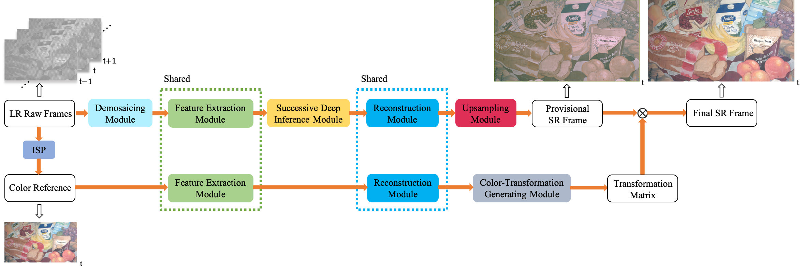
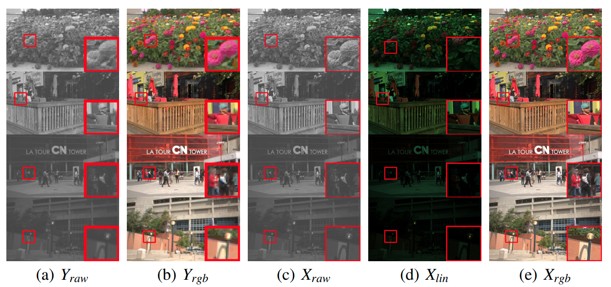

# RawVSR
This repo contains the official codes for our paper:

### Exploit Camera Raw Data for Video Super-Resolution via Hidden Markov Model Inference
[Xiaohong Liu](https://xiaohongliu.ca), Kangdi Shi, Zhe Wang, [Jun Chen](http://www.ece.mcmaster.ca/~junchen/)



Accepted in _IEEE Transactions on Image Processing_

[[Paper Download](https://arxiv.org/abs/2008.10710)]   [[Video](./assets/RAW_VSR_Video.mp4)]
___


## Dependencies and Installation
- Python >= 3.8 (Recommend to use [Anaconda](https://www.anaconda.com/download/#linux))
- [PyTorch >= 1.7.0](https://pytorch.org/)
- NVIDIA GPU + [CUDA](https://developer.nvidia.com/cuda-downloads)

1. Clone repo
    ```bash
    $ git clone https://github.com/proteus1991/RawVSR.git
    ```
1. Install dependent packages

    ```bash
    $ cd RawVSR
    $ pip install -r requirements.txt
    ```
1. Setup the Deformable Convolution Network (DCN)
   
    Since our RawVSR use the DCN for feature alignment extracted from different video frames, we follow the setup in [EDVR](https://github.com/xinntao/EDVR#wrench-dependencies-and-installation), where more details can be found.
    ```bash
    $ python setup.py develop
    ```
   
    Note that the ```deform_conv_cuda.cpp``` and ```deform_conv_cuda_kernel.cu``` have been modified to solve [compile errors](https://github.com/open-mmlab/mmediting/issues/84) in PyTorch >= 1.7.0. If your PyTorch version < 1.7.0, you may need to download the original setup code.

## Introduction
- ```train.py``` and ```test.py``` are the entry codes for training and testing the RawVSR.
- ```./data/``` contains the codes for data loading.
- ```./dataset/``` contains the corresponding video sequences.
- ```./dcn/``` is the dependencies of DCN.
- ```./models/``` contains the codes to define the network.
- ```./utils/``` includes the utilities.
- ```./weight_checkpoint/``` saves checkpoints and the best network weight. 

## Raw Video Dataset (RawVD)
Since we are not aware of the existence of publicly available raw video datasets, to train our RawVSR, 
a raw video dataset dubbled as **RawVD** is built.


- RawVD download (>110G): [BaiduYun](https://pan.baidu.com/s/1ZMOXxiCE1K1RqfdMamWjXg), password: b300.

- Only test dataset: [Google Drive](https://drive.google.com/file/d/1N2rX52lU175-7KsffSAPl-qUuX8iJ_WB/view?usp=sharing).
   

In this dataset, we provide the ground-truth sRGB frames in folder ```1080p_gt_rgb```. Low-resolution (LR) Raw frames are in folder ```1080p_lr_d_raw_2``` and ```1080p_lr_d_raw_4``` in terms of different scale ratios.
Their corresponding sRGB frames are in folder ```1080p_lr_d_rgb_2``` and ```1080p_lr_d_rgb_4```, where **d** in folder name stands for the degradations including defocus blurring and heteroscedastic Gaussian noise.
We also released the original raw videos in Magic Lantern Video (MLV) format. The corresponding software to play it can be found [here](https://github.com/ilia3101/MLV-App).
Details can be found in Section 3 of our paper.

## Quick Start

### 1. Testing
Make sure all dependencies are successfully installed.

Run ```test.py``` with ```--scale_ratio``` and ```save_image``` tags.
```bash
$ python test.py --scale_ratio 4 --save_image
```
The help of ```--scale_ratio``` and ```save_image``` tags is shown by running:

```bash
$ python test.py -h
```

If everything goes well, the following messages will appear in your bash:

```
--- Hyper-parameter default settings ---
train settings:
 {'dataroot_GT': '/media/lxh/SSD_DATA/raw_test/gt/1080p/1080p_gt_rgb', 'dataroot_LQ': '/media/lxh/SSD_DATA/raw_test/w_d/1080p/1080p_lr_d_raw_4', 'lr': 0.0002, 'num_epochs': 100, 'N_frames': 7, 'n_workers': 12, 'batch_size': 24, 'GT_size': 256, 'LQ_size': 64, 'scale': 4, 'phase': 'train'}
val settings:
 {'dataroot_GT': '/media/lxh/SSD_DATA/raw_test/gt/1080p/1080p_gt_rgb', 'dataroot_LQ': '/media/lxh/SSD_DATA/raw_test/w_d/1080p/1080p_lr_d_raw_4', 'N_frames': 7, 'n_workers': 12, 'batch_size': 2, 'phase': 'val', 'save_image': True}
network settings:
 {'nf': 64, 'nframes': 7, 'groups': 8, 'back_RBs': 4}
dataset settings:
 {'dataset_name': 'RawVD'}
--- testing results ---
store: 29.04dB
painting: 29.02dB
train: 28.59dB
city: 29.08dB
tree: 28.06dB
avg_psnr: 28.76dB
--- end ---

```
The RawVSR is tested on our elaborately-collected RawVD. Here the PSNR results should be the same as Table 1 in our paper.


### 2. Training
Run ```train.py``` without ```--save_image``` tag to reduce the training time.
```bash
$ python train.py --scale_ratio 4
```
If you want to change the default hyper-parameters (e.g., modifying the ```batch_size```), simply go ```config.py```. All network and training/testing settings are stored there.

## Acknowledgement
Some codes (e.g., DCN) are borrowed from [EDVR](https://github.com/xinntao/EDVR#wrench-dependencies-and-installation) with modification.


## Cite
If you use this code, please kindly cite
```
@article{liu2020exploit,
  title={Exploit Camera Raw Data for Video Super-Resolution via Hidden Markov Model Inference},
  author={Liu, Xiaohong and Shi, Kangdi and Wang, Zhe and Chen, Jun},
  journal={arXiv preprint arXiv:2008.10710},
  year={2020}
}
```

## Contact
Should you have any question about this code, please open a new issue directly. For any other questions, you might contact me in email: liux173@mcmaster.ca.